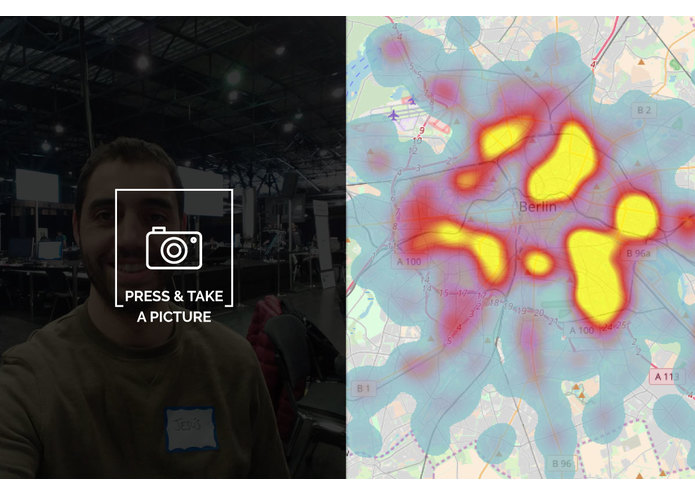

# berlin-berlout
Could you get into a berlin exclusive nightclub?

Criteria of admission:
- Dark clothes
- Denim clothes: jeans
- No more than 3 people
- Around 30s
- No laughing
- No drinks

### How it works?
Berlout tells users if they fit the admission criteria for Berlin clubs. You only have to take a picture. And computer vision algorithm identifies elements related with your probability of being rejected. You will see what clubs you could enter with more chances according to this evaluation.
